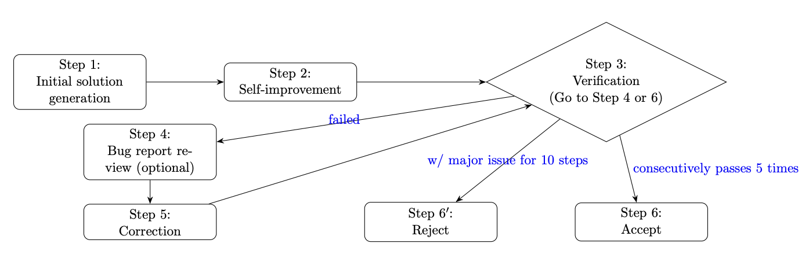

## What Is This

To better understand the application of AI to research-grade mathematics, researchers published [first proof](https://arxiv.org/html/2602.05192v1), a collection of ten questions from their personal work which have been solved privately but are not yet public. They invited the community to attempt to solve them with AI before the solutions are released (at 11:59 PM PT on February 13th).

This repository documents the work of an agentic AI system I assembled and tasked to solve questions 4, 6, and 10. All candidate solutions are presented alongside an AI-generated 'short summary' pdf for the reviewer's convenience. 

## Overview
I ran questions 4, 6, and 10 through the pipeline (built around the automated Gemini 3.0 Pro API and the manual ChatGPT 5.2 Pro web interface) detailed below. The automated stage returned 'validated candidate solutions' for q4 and q10 but failed to find one for q6. The manual stage cleared that q10 candidate with revisions but indicated the q4 candidate was incomplete. 

System logs reveal that a candidate attained one 'validated' result for q6 (it requires two to pass this stage). I moved this candidate to the manual stage as well, although both the automated *and* manual stage indicated this candidate was incomplete.

No issues were raised for the revised q10 candidate.

Additionally, I ran questions q4, q6, and q10 entirely through the Claude user interface (Opus 4.6, max reasoning). The interface crashed and was unrecoverable for q6, but I have included the outputs from q4 (*"a powerful partial result"*) and q10 (*"I successfully solved the problem"*) here as well. 

#### See summary results for
- [Question 4](candidates-pipeline/q4/q4_short.pdf) and [Question 10](candidates-pipeline/q10/q10_short.pdf) on the full pipeline, 
- the log-recovered candidate result for [Question 6](candidates-misc/q6-pipeline-log/q6_short.pdf), and
- Claude's process on [Question 4](candidates-misc/q4-claude/q4_claude_short.pdf) and [Question 10](candidates-misc/q10-claude/q10_claude_short.pdf).

Complete transcripts are shared and linked at the [**Chats and Logs**](#Chats-and-Logs) section below.

## Contents

`/candidates-pipeline` \
The main results; a run of a forked copy of Huang and Yang’s agentic solver for gold-level IMO problems on questions 4, 6, and 10. These questions were selected based on a combination of which problems gemini/gpt identified as [more attainable](https://gemini.google.com/share/6a5e93af2410) and as [more likely to be formalizable in Lean](https://chatgpt.com/share/698e6224-24b4-8009-806c-96885f6c1346). Plans to run all 10 were abandoned due to programmatic (API) cost constraints.

`/candidates-misc` \
Solutions taken from other methods. This includes q4 and q10 conducted entirely through the claude opus 4.6 web interface, and the q6 candidate recovered from pipeline logs.

`/pipeline-logs` \
A collection of raw logs from the pipeline runs on q4, q6, and q10.

`/prompt-specs` \
A copy of all prompts used in the reconstructed pipeline, matched to the steps of the pipeline framework below.

`/problem-inputs` \
A collection of all of 10 problems, [lightly adapted](#changes-to-problem-statements) from the first proof [latex file](https://codeberg.org/tgkolda/1stproof/src/branch/main/2026-02-batch/First_Proof.tex). Only q4, q6, and q10 were used in this pipeline, although all 10 were used to generate deep research results. 

`/deep-research` \
A deep research pull for all 10 open problems made through Gemini's chat interface (with one from ChatGPT), conducted before solutions are shared online. Evaluating the pipeline with a literature review as an input will not be possible after 2/12; these static results preserve that option. However, **the research documents are not used in any candidate solution** and are only shared as a resource for future attempts.

All deep research outputs can also be found [here](https://drive.google.com/drive/u/0/folders/16lpYOw9huSxL7nOoVLWIHgw4615LSrlV).

## Pipeline Details
The 'full pipeline' includes identifying a candidate solution via [Huang and Yang’s agentic system](https://arxiv.org/pdf/2507.15855) for gold-level-IMO challenges, then running that candidate through the gpt-5.2 Pro web interface with a simple process detailed below.

### Automated Pipeline Framework:
The pipeline operates in 6 steps:
1. **Solution Generation.** Create the first pass at a solution to the problem.
2. **Improvement.** Improve this initial candidate.
3. **Verification.** Feed the current candidate into a verification agent, and either accept or reject with a detailed 'bug report'
4. **Bug Report.** Extract the bug report from the verification agent, if provided.
5. **Correction.** Revise the candidate based on the details of the bug report. Return to Step 3 (Verification).
6. **Accept/Reject.** After 5 consecutive verified candidates, 10 consecutive candidates with 'critical errors,' or 30 total runs, Accept or Reject the candidate for a final determination.

Informally, I think of this as a system detailing a 'Generation,' 'Revision,' and 'Verification' agent similar to [DeepMind's Aletheia](https://github.com/google-deepmind/superhuman/blob/main/aletheia/Aletheia.pdf), where step 1 is generation, steps (2, 4, 5) are revision, and step 3 is verification.

#### Adaptions:
I adapted this framework in a few ways:
- Minor revisions for efficiency, robustness, and device-compatibility (I made it run consistently on my device).
- I changed the hyperparameters num-agents = 3 and max-workers = 3.
- I defined and set a new 'error threshold of invalid runs' to 8. On the 8th consecutive failure, the agent will exit the loop and return unsuccessful (formerly 30).
- I defined and set a new 'num correct threshold' of 2 consecutive validated runs before announcing a solution (formerly 5). On the second consecutive verified candidate solution, the agent will exit the loop and return the 'validated' solution candidate.

All of these changes were made due to cost constraints and likely undercut the capability of the system. For example, Huang and Yang recommend '10-20 agents' for harder problems [https://github.com/lyang36/IMO25]; I've confined the system to 3.

### Pipeline Addendums (Manual):
I planned to run all ten problems through the pipeline, with an additional fixed processing input and output stage. The additional input was to be the deep research literature results, but this **was not performed** on submitted runs.

The additional output step, which **was performed** on pipeline outputs, is detailed here. It consists of four sequential inputs to the gpt-5.2 Pro web interface, including the problem statement and the 'validated' candidate solution, detailed here:

##### Step 1

> This problem was recently proposed:
>
> {Problem .tex file}
>
> Rigorously evaluate the following candidate solution and make a determination of its correctness:
>
> {candidate solution text}

##### Step 2

> Understood. Now formally and rigorously complete the candidate solution.

##### Step 3

> Write up this solution in a single copy-paste latex block in a proof that conforms to the levels of rigor and scholarship prevailing in the mathematics literature. Citations should include precise statement numbers and should either be to articles published in peer-reviewed journals or to arXiv preprints.

Some of this text was adapted from the [First Proof website's](https://1stproof.org/) *"Note on Proposed Solutions"*.

##### Step 4
> Great. Now condense this into a very short (less than one page) latex note. Focus on explaining what the key ideas of the solution are and how the hypotheses are utilized to reach the conclusion such that a domain expert can quickly understand the approach.

Some of this text was adapted from Terence Tao's [commentary](https://github.com/teorth/erdosproblems/wiki/I-think-I-managed-to-get-my-favorite-AI-tool-to-solve-an-open-Erd%C5%91s-problem!--What-do-I-do-next%3F) on the [AI Contributions to Erd\H{o}s Problems](https://github.com/teorth/erdosproblems/wiki/AI-contributions-to-Erd%C5%91s-problems) page about unverified solutions. 

## Chats and Logs
The chat interface part of the pipeline can be verified at these links: [Chat Process Q4](https://chatgpt.com/share/698f80a4-1da4-8009-8054-9f624b68cd87), [Chat Process Q10](https://chatgpt.com/share/698f8106-6bc4-8009-8b6c-6939d9a7ef4a).
The chat interface for the log-recovered candidate for question 6 can be found at  [Chat Process Q6](https://chatgpt.com/share/698f8118-7b54-8009-aaec-c7118cb494a0).
The chat interface for runs conducted entirely through the Claude web interface can be found at [Question 4](https://claude.ai/share/8f1b0629-4c70-4b86-979e-1edbdf4fc3b0) and [Question 10](https://claude.ai/share/c33622f3-a957-49bd-8ad5-124c29ee084f).

The raw logs detailing pipeline runs for q4, q6, and q10 are shared in `/pipeline-logs`.

## Results

#### Manual Stage Accuracy Indicators
At the second manual step, ChatGPT 5.2 Pro indicated that the candidates for q4 and log-recovered q6 were incomplete. I'll note that in my experience, AI tools are capable of both false positives *and* false negatives when working with formal math. 

To paraphrase its commentary on Q4:

>A general proof for all $n$ is not established by the candidate solution; the appeal to a finite-free Stam theorem for this $\phi_n$ ​is unsupported by the available cited literature.

and the logged-candidate Q6:

>To upgrade Theorem 2 to $|S| \geq c 𝜀 n$ with absolute c, the proof needs a log-free selection/rounding statement. The candidate solution’s heavy-edge/independent-set reasoning does not supply this lemma; it would need an additional spectral-discrepancy/rounding argument beyond Foster’s theorem.

No issues were raised in the chat-revised candidate for q10. 

#### DeepMind Autograder

Once solutions are decrypted, I plan to run these candidate solutions through the ProofAutoGrader detailed in DeepMind's *[Towards Robust Mathematical Reasoning](https://arxiv.org/pdf/2511.01846)*. This automated grading system was shown to correlate well (Pearson $r = 0.96$) with human grading on mathematical proofs. 

*Space left unassigned for automated grading results*

#### Disclaimer
This is not a formal paper and I don't claim to have solved any problems. I don't have the domain expertise to verify these candidate solutions (though I also lack the domain expertise to cheat on them).

## Limitations & Future Work
The domain transfer of the automated grader from competition proofs (IMO-ProofBench) to true lemmas is a notable limitation. It is still the best automated grader I can access, and I expect it to contain *some* signal.

This pipeline is *very* cost-constrained (within a personal budget of $100 USD). Gemini 3.0 Pro was the cheapest frontier model that (in my opinion) had even a chance of success, but Opus 4.6, GPT-5.2 Pro, and Gemini 3 DeepThink all meaningfully outperform it on math & physics benchmarks. 

System runs are also severely limited by the number of agents attached to the system (I ran 3, while the developers recommend 10-20 for 'hard' IMO problems).

## Appendix

### Changes to Problem Statements
All problem files (q1-q10) are taken from the 'first proof' website and arxiv note. They are minimally altered to better aid in AI processing:

- \aO --> \mathcal{O}
- \bR --> \mathbb{R}
- \vecop(...) --> \operatorname{vec}(...)
- {\it ...} --> Markdown italics \*...\*
- \smallskip --> delete
- \setlength\itemsep{...} --> delete
- \nonumber --> delete

One problem description, q9.tex, was more heavily revised into version q9b.tex. This change is explained in the [Final Notes](#final-notes) subsection.

### Presentation & Formatting Changes
I used the same [latex presentation format](https://github.com/google-deepmind/superhuman/blob/main/aletheia/Erdos/Erdos.pdf) as in DeepMind's Alethea repository for the presentation of system inputs/outputs (This does not include system prompts in the autonomous component). I minimally processed the .tex files to debug rendering errors (defined three unspecified commands and added two newlines). 

### Negative/Other Results

In the interest of including negative results, I had initial exploratory runs with ChatGPT Pro on [question 4](https://chatgpt.com/share/698fb299-44f4-8009-bb81-3905533a91d5) and [question 6](https://chatgpt.com/share/698fb2ba-dda8-8009-9768-632d0ddcb047) which did not return a full solution. 

I also had a run of question 6 on Claude 4.6 Opus, but this result was completely lost and remains unrecoverable from Claude's user interface. I was unable to get the model to present a complete candidate solution up until this crash.

### Final Notes

Some other interesting things happened that I wanted to share.

- The syntax of question 9, when I fed it into Gemini's Deep Research, triggered safety flags that refused to conduct a research run. My guess is it was either flagged as something adversarial in the cryptography domain, or as a jailbreak attempt due to the syntax (or both). I eventually reverted to ChatGPT's DeepResearch, which had no problem with it.
- One ChatGPT run, when asked to formalize the findings for Q6, got stuck in an infinite loop. It ran for nearly an entire day (>23 hours) before I aborted it. This may or may not be an artifact of heavy reasoning while solving unresolved formal math.
- I hit my daily rate limits for Gemini 3.0 Pro while running the automated stage of q6 (you can see this in the end of the log files). I did try another set of runs, changing some parameters and giving two agents space to run until completion, and considered whether I should include any new candidates. It was ultimately a moot point; no additional run on q6 returned a single 'validated' result.